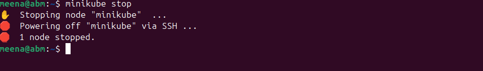
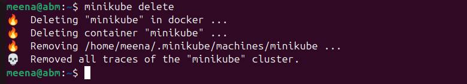
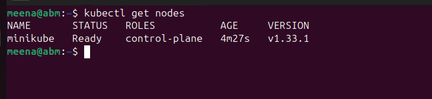
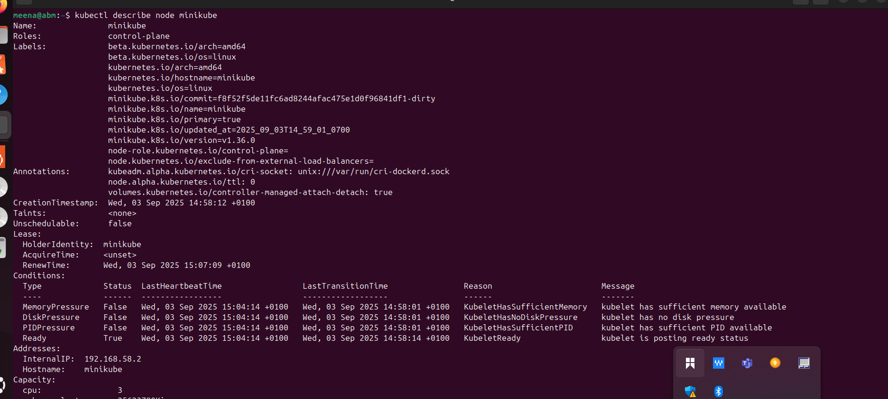
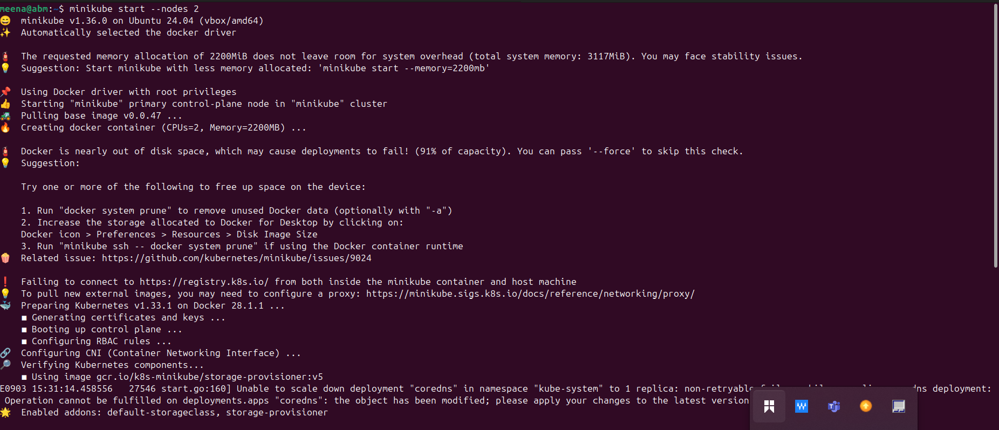
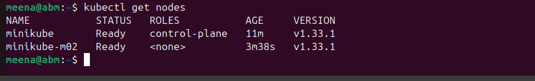

# Working_With_Kubernetes_Nodes 

## What is a Node ? 
In Kubernetes, a node is a worker machine (virtual or physical) that runs containerized applications. It’s the fundamental building block of a Kubernetes cluster where workloads are executed.

Each node has the services necessary to run pods (the smallest deployable units in Kubernetes).

A node typically includes:

Kubelet – An agent that runs on every node and communicates with the Kubernetes control plane. It makes sure containers described in pod specs are running and healthy.

Container runtime – Software that runs containers (e.g., Docker, containerd, CRI-O).

Kube-proxy – A network proxy that handles communication between pods and services, managing network rules and load balancing.

## Managing Nodes in Kubernetes: 
1. Start Minikube cluster: "minikube start"

This command start a local kubernetes cluster using a single-nodes minikube setup. it prvisions a virtual machine as the kubernetes.

2. stop Minikube cluster; "minikube stop"

This stop the running minikube (local kubernetes cluster) preserving the cluster state.

3. Deleting Minikube cluster ; "minikube delete"

This delete minikube kubernetes cluster and its associated resources.

4. View Nodes: "kubectl get nodes'

This list all the nodes in the kubernetes cluster along with their current status.

5.Inspect a node: "kubectl describe node minikube"

## Node Scaling and Maintenance in Minikube
Minikube is designed primarily for local development and testing, so managing and scaling nodes isn’t as critical as in production Kubernetes environments. Still, it’s valuable to understand the concepts since they mirror what happens in real clusters.

1. Node Scaling

By default, Minikube runs as a single-node cluster, meaning the control plane and worker run on the same VM/container.

For experimentation, Minikube does allow multi-node clusters: "minikube start --nodes 2"

this create two nodes (minikube and minikube -m02) which you can verify with : "kubectl get nodes"

